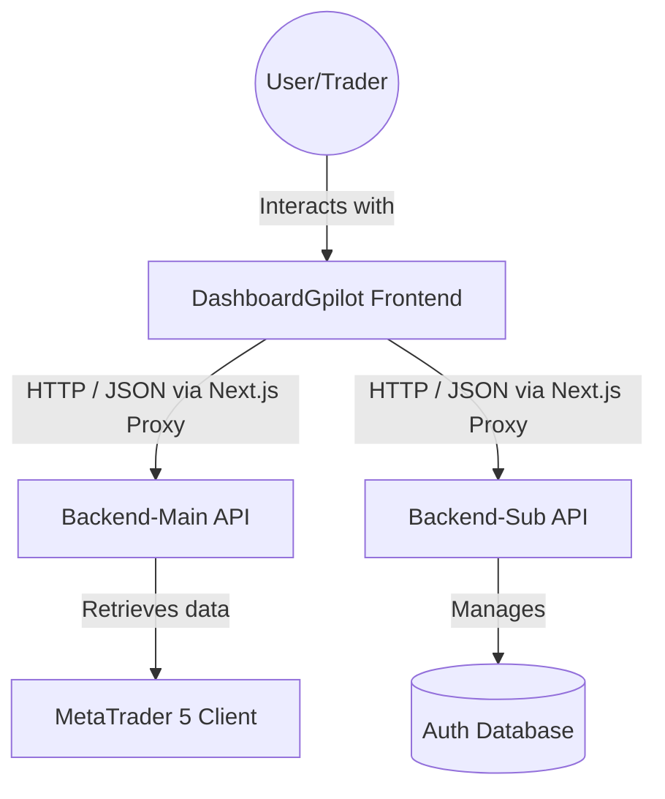

# Architecture Overview — DashboardGpilot Frontend

This document describes the high-level architecture and design decisions for the DashboardGpilot Frontend application.

## 🗺 System Context

The DashboardGpilot Frontend is part of a larger ecosystem designed for real-time Forex trading management. It acts as the primary user interface for traders to monitor their accounts and manage their investments.



## 🏗 Component Diagram (Folder Structure)

The project follows a **Feature-based Clean Architecture** to ensure separation of concerns and maintainability.

```
src/
├── app/                        # Next.js App Router (Routing & Pages)
├── features/                   # Feature Modules (Feature UI + Hooks)
│   ├── account/                # Components specific to account
│   ├── dashboard/              # Home Overview & Analytics [REFACTORED]
│   ├── history/                # Trade Logs
│   └── cashflow/               # Fund Movements
├── shared/                     # Shared cross-feature code
│   ├── ui/                     # Presentation Layer: Reusable UI (DataTable, Charts, RiskMetrics) [UPDATED]
│   ├── api/                    # Infrastructure: API client & Endpoints
│   ├── services/               # Application Layer: Business Flow Orchestration
│   ├── types/                  # Domain Models & Type Definitions
│   └── utils/                  # Utility Functions (Crypto, Logger, etc.)
├── layouts/                    # Shared Layouts (Sidebar, TopBar)
└── styles/                     # Global Styles & Themes
```

### Layer Responsibility

1.  **Presentation Layer (`features/`, `app/`, `shared/ui/`)**: Handles user input and UI rendering.
    - **Feature components**: Specific to a business use case (e.g., `ProfileCard`).
    - **Shared UI**: Universal, reusable components (e.g., `DataTable`, `BalanceChart`).
    - **App Router**: Renders static shell and handles routing.
2.  **Application Layer (`shared/services/`)**: Orchestrates the business flow, calls API clients (Infrastructure), and transforms data into Domain-friendly models.
3.  **Domain Layer (`shared/types/domain/`)**: Contains pure business entities and rules. No external dependencies.
4.  **Infrastructure Layer (`shared/api/`)**: Handles external communication (HTTP fetch), error handling, and cross-cutting concerns (logging, tracing).

## 📊 Key Data Flows

### 1. User Registration Flow
1.  User submits registration form in `features/auth`.
2.  `AuthService.register()` is called.
3.  Password for MT5 is encrypted using `CryptoUtils` (AES-256-GCM).
4.  `apiClient` sends data to the `Backend-Sub`.
5.  `Backend-Sub` validates and stores the user.

### 2. Account Data Fetching (Optimized)
1.  Page in `app/account` renders.
2.  `useAccountData()` hook calls `AccountService.getAccountSummary()`.
3.  `AccountService` calls `apiClient` via the Next.js Gateway Proxy to the optimized `/api/v1/dashboard/account` endpoint.
4.  Data is returned as a lightweight summary, reducing bandwidth and CPU usage.

## 📡 Observability Strategy

- **Structured Logging**: All logs are handled by `src/shared/utils/logger.ts` with levels (INFO, WARN, ERROR, DEBUG).
- **Distributed Tracing**: Every request generated by `apiClient` includes a unique `X-Trace-ID` header.
- **Error Handling**: Standardized `ApiError` class and `ServiceResponse` wrapper ensure consistent error reporting across the application.

## 🧪 Testing Strategy

- **Unit Testing**: Vitest is used for testing services, utilities, and hooks.
- **UI Testing**: React Testing Library + happy-dom for component validation.
- **Naming Pattern**: All test cases follow `[MethodName]_[Scenario]_[ExpectedBehavior]`.
- **Target Coverage**: 80% for Domain logic, 70% for Application services.
